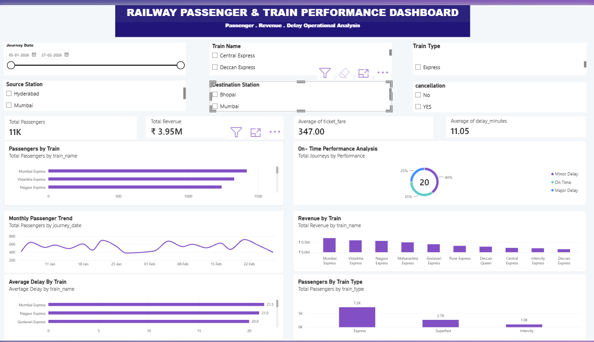

# 🚆 Railway Passenger & Train Performance Dashboard

## 📌 Project Overview

This project is an interactive Railway Passenger & Train Performance Dashboard developed using MySQL, SQL, Power BI and DAX.

The dashboard analyzes passenger volume, revenue, fare, delays, train performance and cancellation patterns using a fictional/practice dataset.

## 🎯 Project Objectives

- Analyze total passenger volume
- Analyze total revenue
- Calculate average fare
- Analyze train delays
- Measure on-time performance
- Analyze cancellation rate
- Compare trains and train types
- Analyze monthly passenger trends

## 🛠️ Tools & Technologies

- MySQL
- SQL
- Power BI
- DAX

## 🧹 Data Cleaning

SQL was used for data validation and cleaning, including:

- Duplicate record checking
- Missing value checking
- Invalid passenger count checking
- Invalid fare checking
- Cancellation value checking

## 📊 Dashboard KPIs

- Total Passengers
- Total Revenue
- Average Fare
- Average Delay
- On-Time Percentage
- Cancellation Percentage

## 📈 Dashboard Analysis

- Passengers by Train
- Revenue by Train
- Monthly Passenger Trend
- Average Delay by Train
- On-Time Performance
- Passengers by Train Type

## 🔎 Interactive Filters

- Journey Date
- Train Name
- Train Type
- Source Station
- Destination Station
- Cancellation

## 💡 Key Insights

- Passenger demand varies across different trains.
- Revenue contribution differs between trains.
- Average delay varies by train.
- Passenger volume changes across the months represented in the dataset.
- Train types show different passenger-volume patterns.

## 📷 Dashboard Preview

## 👨‍💻 Skills Demonstrated

- SQL
- MySQL
- Data Cleaning
- Data Analysis
- Power BI
- DAX
- Data Visualization
- Dashboard Development
- KPI Analysis

> Note: This project uses a fictional/practice dataset and does not represent actual Indian Railways operational statistics.
